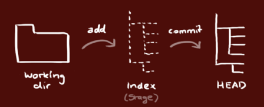

To view this assessment on Github please visit the [Github repo here](https://github.com/angieloux/T3A1_Workbook).

# T3A1 Workbook

# **Q1 - Provide an overview and description of a standard source control process for a large project.**

Source control (commonly referred to as version control) is the process within the development of a project that allows for tracking and managing of changes in a code base. The ability to track history in Source Control Management ('SCM') systems enables developers within a team to resolve conflicts upon merging code from a variety of machines/sources. (Atlassian 2020; Gehman 2022; Johnson 2016)

Especially in large projects, source control is absolutely imperative--given it is the only way maintain a single source of truth within a large team. It helps foster collaboration (e.g. multiple developers working on the same codebase, editing eachothers code) & increases release speed (e.g. commiting and merging code with no conflicts). 

Some of the key factors for success in SCM are: 
1. Selecting the right SCM for the project (Git, AWS, Helix Core, etc)
2. Pulling the most up-to-date version of the code
3. Commiting often with meaningful commit messages
4. Making the use of branches so that developers can work in parallel with eachother 
(Atlassian 2020; Gehman 2022; Johnson 2016)

To understand how a standard source control process would happen for a large project, let's take a look at Git.

## **Git**

Git is a free & open source, distributed version control system. 'Distributed' means that there is no one 'central' authority, collaborators have the complete history, everything is done offline & changes can be shared without a server (i.e. changes can be done locally and can be 'pushed' later).

### **Components** 

- **Repository ('repo'):** The directory in which changes are tracked
- **Master/main branch:** The main source of truth for the project -- i.e. the 'trunk' of the tree
- **Branch:** A copy of the main where additional changes/features can be added & experimented with (with no fear of breaking the main branch)
- **Add:** Select which files you want to add to a commit/change
- **Commit:** Equivalent to saving a new 'version' of the code. Accompanied by a meaningful commit message so all collaborators can understand what changes are being made & why. A commit is essentially a 'snapshot' in time.
- **Push:** Send changes to the server
- **Pull:** Ask for the most up-to-date version of the codebase from the repo
(Johnson 2016)

### Process

The local repo on your machine is made up of 3 'trees' that are all maintained by git. 
1. **Working directory**: *holds the actual files*
2. **Index**: *staging area*
3. **HEAD**: *points to the last commit made (i.e. the current commit in the working directory)*



(Johnson 2016)

Assuming a central repo has been created (with `git init`) already, each developer will need to clone that repo onto their machine with `git clone <repo_url>` and set up the remote with `git remote add <remote_name> <remote_repo_url>`

Then, each team member can modify files as needed in the **working directory**. Then, the changes that will make up the next commit can be selectively staged (with `git add <file_name`, or `git add .` if all changes are to be staged). Perhaps this is styling, or a bug fix, a general update, ands so on.

Once these changes are committed (with `git commit -m "<meaningful_commit_message>"`), these changes are stored as a snapshot permanently within the git directory (which you can view with `git log` on your machine).

Note, at this stage, the changes are only stored in the `HEAD` on your local machine. They aren't yet in the remote repo. That's the next step.

Depending on your team's process, you may be pushing code directly to the main branch, or to a different branch entirely, for example:


(Atlassian 2020)

Assuming the main branch is called `main`, changes can be pushed to it by using `git push origin main`.

Perhaps you are wanting to create a new feature without breaking the main code. You could create a new branch with `git branch <new_branch_name>`. You can select which branch you are on with `git checkout <branch_name>`. Then, changes can be pushed with `git push origin <branch_name>`.

However, when pushing changes back to the central repo, there is a chance that other changes have already been pushed by another team member (highly likely, especially in a large team). In this case, when trying to push an error message will display. To get around this, a `git pull` can be used to then get the most current version of code to the local machine from the repo. 

Again, in a large team, developers will invetibly come across merge conflict errors that must be resolved. See an example of this in action in the below diagram. If a developer is trying to push code that directly conflicts with commits that are already upstream, Git will error and not push the changes until the conflicts are dealt with. A way to do this is to fetch the most recent commits from the central repo and either 1. rebase their changes over the top of them (i.e. put them at the front) or 2. manually resolve conflicts within the code. This is why it is imperative to commit often, be communicative within your team and make sure each commit has a meanginful message attached to ensure everyone is aware of what is happening and why.


(Better Explained 2015)

# **Q2 What are the most important aspects of quality software?**

A quality piece of software can be considered as something that 1. functions without error and 2. satisfies all requirements as per the spec. The requirements of good software can be *functional* (i.e. what the software or program should **do** - technicality, calculations, data processing, etc) or *non-functional* (i.e. how it should **work** - usability, security, privacy, supportability, etc).

According to the The CISQ Software Quality Model, there are 4 key pillars that can be analysed to determine the quality level of software. These are: 

## **1. Reliability**

Reliability refers to the innate risk that failure may occur, and how stable the program is when exposed to these unexpected, but inevitable situations. Quality software would assure little downtime, no user-facing errors & solid data integrity.

This can be measured in a number of ways, including assessing how many high-priority bugs are in the production code and by using 'load testing' (i.e. how well the program functions under normal conditions)

## **2. Efficiency**

Performance efficiency involves how the use of resources effects a program's response time and scalability, along with how satisfied customers are with the application. The design and architecture of the software can greatly effect/contribute to this. Load testing & stress testing (assessing the max operating capacity) are important when it comes to measuring performance efficiency.

## **3. Security**

Security is vital in quality software. It entails how efficiently a program or application guards itself against breaches & other vulnerabilities. Developers can assess this by evaluating the time taken to patch/fix security issues, as well as by checking previous incidents, how they occurred and what downtime was associated with the event. 

## **4. Maintainability**

Finally, having software that is maintainable refers to how easily it can be modified, adapted (for alternative purposes) or transferred (between teams). Teams must make sure they are staying compliant with coding rules & guidelines as well as maintaining consistency across the codebase. One simple way to track this is by having less lines of code -- more concise, readable and understandable code is easier to maintain and less likely to cause errors.

Other important factors to be considered include rate of delivery (how often new versions are shipped), testability (how easy to debug/provide quality assurance) and usability (how efficient and user-friendly the UI is).

(Maayan 2017)


# **Q3 Outline a standard high-level structure for a MERN stack application and explain the components** 

The MERN stack is named after the four technologies that it incorporates:
1. **M**ongoDB (document database)
2. **E**xpress(.js) (Node.js web framework)
3. **R**eact(.js) (client-side JS framework)
4. **N**ode(.js) (the premier JS web server)

The MERN stack is an full-stack collection of technologies that allow a developer to construct a 3-tier architecture (front end, back end, database) with only JavaScript & JSON. It's a popular solution given it allows developers to create apps 1. quickly & 2. utilising only the JavaScript language.


(MongoDB 2022)

Let's dive into what these three components look like in practice:

## **Front end (React.js)**

The front end of a MERN stack is React.js. React.js is a JS framework that allows for the creation of dynamic client-facing apps in HTML. It is capable of creating complex interfaces that are then connected to the backend server (Express.JS) which will then be rendered to the user's browser as HTML. React is a particularly strong framework given its ability to handle "stateful, data-driven interfaces with minimal code and minimal pain". (MongoDB, 2022)

## **Back end (Node.js & Express.js)**

The second tier, the back end, is comprised of Express.js (server-side framework) which runs within a Node.js server (the premier JS server). The former is known as a fast and minimilast solution for a Node.js framework and simplifies the writing of backend code. It is in charge of handling HTTP requests & responses to and from the server & browser. It also addresses URL routing -- i.e. matching a URL with a server function. 

NodeJS is an open-source runtime environment for JavaScript that enables developers to run code on the server itself. It includes a node package manager (known as 'npm') which lets its users pick specific node modules or packages. 

In practice, XML HTTP requests (known as XHRs), GETs or POSTs are made from React.js front-end, which are then linked to Express.js functions that enable an app to work. Those functions use MongoDB's Node.js drivers to retrieve & modify data within the MongoDB database.

## **Database (MongoDB)**

The third and final tier is the database tier. MongoDB is a very simple database that works succinctly and easily with React, Express & Node. A database will store any type of data required (i.e. comments, events, appointments, profile data, etc). 

JavaScript Object Notation ('JSON') documents are created within the React.js front end, which are transferred to the Express.js server, where they are processed. Then, after (and if) validations pass, they are then saved within the MongoDB to be drawn upon later if/when needed. 

(Kenzie Academy from Southern New Hampshire University 2021; MongoDB 2022)

# **Q4 - A team is about to engage in a project, developing a website for a small business. What knowledge and skills would they need in order to develop the project**

When tasked with building a website for a small business, each team member will require a variety of different skills and knowledge to successfully bring the project to completion. There are a number of different project management strategies that are effective to maximise efficiency and workflow of the team as a whole. 

One popular example of this in software development is the Agile methodology. Taking an agile approach involves a focus on making rapid, continuous releases that ensure that both customer feedback and market industry/trends are taken into account with each iteration. This approach will allow the team to accurately assess what knowledge/skills are required, how to delegate tasks most effectively according to strengths/weaknesses, what gaps the team might have and how to solve them, and so on. 

An approach the team might follow could look a little like this: 

- Evaluate individual/collective strengths and weaknesses within the team (i.e. what is possible to create)
- Definition of goal / project scope (incorporating the above)
- High-level product road map 
- High-level release plan
- Micro-level sprint plan 
- Regular stand-ups (check-ins)
- Review of sprints (sprint retrospective -> improve & adapt for future sprints)

In order to successfully carry out each of these steps, the following skills & knowledge are vital:

## **1. Communication skills**

Communication is imperative at every level of the devleopment process, both internally (within the team) and externally (to the small business customer). A team must be able to cohesively communicate with eachother every step of the way in order to align on vision, approach, timelines, responsibilities, issues and much more. Externally, it is important for the person (or persons) who is/are liaising directly with the client to not only be able understand their needs and requirements, but also be able to pass these on accurately and effectively to the development team. Good communication skills promotes team accountability, and the creation of a product that is within scope, meets the clients needs and can be delivered in a timely manner.

## **2. Time management/project management skills**
Perhaps one of the most important parts of a project is managing tasks and workflow. Particularly in software development, given there are so many moving parts and so many people contributing to the solution, a thorough knowledge of some form of task management/ticket system is essential to keep the project on track (e.g. Trello, Jira). Everyone in the team must be familiar with how to use this tool effectively at every stage of its development -- whether it is designing sitemaps or wireframes, to writing code, to debugging, to implementing new features, and so on. This allows the team to align the project with the needs of the client both in terms of functionality and timeframe. It also keeps track of who is doing what and when, ensuring accountability at all stages. Time management skills are absolutely essential.

## **3. Source control understanding**
Working on a website will require each team (or sub team) working on a variety of different functions of the application simultaneously. To ensure there is one source of truth in the code that is created, each team member must have an adequate knowledge of source control (e.g. Git). This includes an understanding of pushing, pulling and merging code (and how to resolve merge conflicts), branching, cloning repositories and more.

## **4. Full stack software engineering capabilities**
A fundamental need for a team to build a website for a small business is a collective understanding of full stack software engineering capabilities. If the client needs information stored within a database (e.g. user information, registrations etc), they must have a team that is equipped to deliver a back end (e.g. MongoDB). The team must posess skills in terms of writing programming language based on the needs of the website (e.g. HTML, CSS, JavaScript) and working with frameworks as required (e.g. Bootstrap, React.js, Angular, etc). Additionally, in planning the website, the team must decide the paricular structure it will take, For example, it might suit the client's end-goal to use an MVC (Model View Controller) architecture. If this were the case, each team member must have an understanding of the various components & the skill set required to make an MVC solution for the client. 

## **5. Quality assurance**
Another core need for the team to deliver a successful product to the client is a thorough understanding of 1. what the core requirements of quality software are and 2. how to achieve them. This involves delivering a solution that is testable, realiable, maintable, efficient and secure. This involves being able to write concise, DRY code that is understandable and easily readable, so as to make it easier for others to debug/find errors. Additionally, the team should be comfortable with writing in TDD (Test Driven Development) format. Taking a mobile-first approach is also incredibly important these days, as users will be viewing the website on a variety of different browser sizes (e.g. mobile, tablet, laptop, desktop) and types (i.e Chrome, Firefox, Safari, Edge). Lastly, building a website that is focused on security is crucial, to prevent data/security breaches--in turn protecting the client and its users from cyber attacks. 

The above list covers at a high level the knowledge and skills required by the team. However, it is by no means an exhaustive list. To deliver an effective and suitable website solution for the small business, the team must ensure adequate planning (including high level roadmaps, sprints, etc) that account for all of the items discussed above (and more), is implemented, followed, adpated/iterated upon and understood by all parties internally and externally throughout the development cycle. Thorough and open communication is absolutely crucial at all stages throughout the cycle to ensure client satisfaction, happy users and a well-oiled development team.

# **Q5 - With reference to one of your own projects, discuss what knowledge or skills were required to complete your project, and to overcome challenges.**

A solo project I completed when learning Ruby on Rails was building a two-sided marketplace-- entitled Farmer's Marketplace. The premise of the website was to discourage food waste, in which people could buy and sell leftover/surplus groceries, locally-grown produce and more in their local neighbourhood by creating a profile listing items online (think Gumtree, but for food).

To get a micro-level understanding of the knowledge and skills that were required of me to complete the project & overcome challenges, let's dive into my process:

## **1. Market research knowledge**

It was important to me to first understand the lanscape of a potential industry / challenge that 1. aligned with my interests and 2. was socially conscious. Once deciding on an industry/issue, I conducted market research and collated this data to brainstorm a way to to align said issue (food waste in Australia leading to food insecurity & hungry families) with a solution (food distribution).

## **2. Project & time management skills**
An important part of the project was ensuring I incorporated a high-level plan into a project management system (Trello). I'd worked with Trello in the past, and so I used this as my task management system to initially plan out at a high level the development cycle. My first draft of the Trello board incorporated the next few planning steps, which then informed how I would build out the Trello board for the entire project (i.e. features, timelines, sprinkles, etc). Having an understanding of MVP was important here, to ensure I was building something achievable (and could add to it if time allowed). I added a column for bugs as they arose during the build stage.

## **3. Visualisation & planning skills**
This included designing wireframes (Balsamiq) & a sitemap. It was not my first time working with wireframes & sitemaps, having built a basic HTML/CSS website previously. I leveraged this knowledge to plan out a baseline of what the website was to look like and how it was to function. This allowed me to start understanding the project scope & remove uncertainty by having visual plan of action. This meant when I got to build stage I was able to build towards something -- rather than a challenge of trying various things with no actual visualisation in my mind.

## **4. Relational database understanding**
It was important to be able to effectively develop an Entity Relationship Diagram (ERD), which meant I needed to be able to determining appropriate model/controller names & structures/relationships. This step was actually one of the most crucial, and time-consuming of the planning stage. Given this was my first exposure to RoR and MVC archictecture in general, I struggled to create a structure/scope without seeing it in action first. I'll delve into this problem more in the next question. I tested out various ERD-making tools (Lucidchart, Draw.io, etc) and decided on one to map out a draft ERD. Given my 'green-ness', I had to do significant additional research into MVC archiecture. I started playing around with various model/controller/view setups in VSCode to understand how they interacted with eachother before then deciding on a structure.

## **5. Developing the application itself**
After building out a scope, structure and visual representation of what I wanted to build, that's when I began to code. 

- **Source control**:  I needed an understanding of how to create a Github repository, how to clone it to my local machine & commit & push code with meaningful commit messages.
- **Maintaining task management/time management:** with Trello (including adding bugs as they came up)
- **Ruby on Rails:** I leveraged my knowledge of the programming language Ruby, as well as HTML/CSS to build an MVC-structured, mobile-first app with a Rails framwork.
- **PostgreSQL:** I chose to use the PostgreSQL database and so an understanding of relational databases & how associations between tables worked (one-to-one, one-to-many, etc) and how to represent these within my codebase was also needed. 
- **Ruby gems:** I read extensive documentation on various gems to enhance the functionality of the app and keep code as DRY as possible (e.g. devise)
- **Authentication:** I used the Devise gem to enable authentication in the way of allowing a user to sign up, sign out, sign in, recover their password etc.
- **Authorization:** This was also imperative so as to allow only authenticated users to create/edit/delete their own listings, and view/purchase other user's listings to make sure no any unauthorized actions took place. 
- **Deployment:** I learned how to use the Heroku deployment platform to build a solution that was stable and live.
- **Image storage (S3):** I leveraged my newfound understanding of AWS to create a cloud storage solution for storing images associated with listings, rather than storing them locally so as to enhance the speed and functionality of the website.
- **Payment services (with Stripe):** I learned how to build out a dummy Stripe platform so users can make purchases of desired listings.

In conclusion, ensuring a thorough and well-thought structure and scope was defined before building out any of the code was absolutely pivotal in terms of avoiding as many challenges as possible. However, as challenges (inevitably) arose, it was important that I leveraged the available information online (whether from documentation, forums, other colleagues) to ensure I was addressing bugs or other issues in an appropriate way. As As this was my first 'complex' project, I learned a lot from the process and will address what I could have done better in the subsequent question. 

# **Q6 With reference to one of your own projects, evaluate how effective your knowledge and skills were for this project, and suggest changes or improvements for future projects of a similar nature**

As mentioned above, as my first RoR project, there are a number of ways I could (*and would*) improve for future projects of a similar nature. 

## **1. My understanding of Rails / MVC architecture / relational databases**
Though my understanding of Ruby as a programming language was foundational and sound at this stage, I believe a lack of more advanced knowledge in how it incoporated into the Rails framework in a practical way limited my ability to create a more intuitive application & delayed development (when time was spent googling Rails magic!). 

## **2. Scoping issues**
MVC architecture took some time to really get my head around, and so I spent time re-working my structure I had previously decided on which pushed out timeframes. I found it hard to build a concrete plan without actually testing things out to see how they worked. This included spending time understanding relational databases and associations -- and more simply, what models and controllers I should use and what I should name them. I spent time reworking and renaming things when I realised my original ERD was not as intuitive as it could be. I found scope the hardest hurdle to overcome, not quite understanding my abilities before putting them to the test. 

## **3. Test Driven Development (TDD)**
Though I completed manual tests & implemented a lot of error handling, I did not create a Test Driven Development environment. I believe that was a massive weakness for this project. Given the timeframe, TDD was a learning hurdle for me that I did not allow sufficient time for and would absolutely implement this within my next project as it is vital in creating a secure, quality application.

## **4. Front end**
This was a marked project for my course, and the rubric did not include any styling requirements. Therefore, the front of the app is quite basic and lacking. Though it was fine for the purposes of the project, for my next project I would perhaps learn Tailwind (as opposed to Bootstrap, as I used) to create some easy stylistic wins and a mobile-first approach. I have since begun to learn JavaScript so I would also incorporate that to create a more dynamic, user friendly solution. 

Overall, my main requirements and focus for this project were 1. to follow the rubric/requirements & 2. learn how to use all of these technologies together. Both of these things I achieved and feel confident about. However, though I had logged my tasks very specifically through Trello, given my beginner-level understanding of these various technologies and concept and how they work together inveitbly led to bugs and delays. This meant meant a lot of de-scoping & reworking my plans mid-project. Though this was frustrating it also did let me get a grasp on my current abilities and understand where my strengths and weaknesses are. Armed with that knowledge, I can better plan in the future for a project of a similar nature. 

# **Q7 Explain control flow, using an example from the JavaScript programming language**

The concept of control flow is simply the process of the sequence or order by which statements are read and executed by the program. The normal, non-manipulated flow fo a program is sequential, like a story:

```js
let pet = "Bruce" 
console.log(`Hello, I have a pet named ${pet}`)
```

If this sequence needs to be manipulated, flow controls are required. These can be iterative statements (i.e. loops) and control statements (`if` / `else if` / `else`). 

`<div style="page-break-after: always;"></div>

Let's look at an example using the latter:

```js
function weather(temp) {
    // if the condition in () is true (i.e. if the temp is 10 or less), it will return the string, else it will evaluate the next statement
    if (temp <= 10) return "Stay inside!"

    // if the temp is more than 10 but less than or equal to 15, return the string
    else if (temp > 10 && temp <= 15) return "Bring your scarf and beanie!"

    // if the temp is more than 15 but less than 20, return the string
    else if (temp > 15 && temp < 20) return "It's pretty nice outside, but bring a light jacket"

    // return this if all other conditions evalue to false (i.e. if temp is over 20)
    else return "It's warm!"
}

```
This same function can also be reflected using a `switch` statement. 
```js

// The program will use the switch statement to make a strict equality (===) between the case & the expression
switch(temp) {
    // If the case matches the expression, the case clause will execute
    // If there is a return statement, it will not evaluate the next case
    case temp <= 10: 
        console.log("Stay inside!");
        // If there is no return statement, a break; statement can be used to not evaluate any more code
        break;
    case (temp > 10 && temp <= 15): 
        console.log("Bring your scarf and beanie!");
        break;
    case (temp > 15 && temp < 20): 
        console.log("It's pretty nice outside, but bring a light jacket");
        break;
    default: 
        console.log("It's warm!"); // default is equivalent to the else statement
}

```

There are also a number of iterative statements available in JavaScript, such as loops: `for`, `for/in`, `for/of`, `while`, `do/while`, 
These are ways to manipulate the sequence of code by repeating certain expressions or blocked based on specific conditions. One example of a `for` loop is below.

A `for` loop takes 3 parameters: (`initialization`; `condition`; `finalExpression`)

The following code will iterate through integers starting from 0, ending at 2.

`let i = 0` initializes the first value before the execution of the first loop.

`i < 3` defines the `condition`. If true, the block of code will execute. Else if it evaluates to false, the loop will break.

`i++` is the `finalExpression` that is executed after the loop iteration, which will increment the counter by 1 each time.

```js
for (let i = 0; i < 3; i++) {
  console.log(i); // first loop -> 0, second loops -> 1, third loop -> 2
}

// 0 
// 1
// 2
```

(Cleary 2020; Moreira 2019; Mozilla 2022b)

# **Q8 Explain type coercion, using examples from the JavaScript programming language**

Type coercion refers to the process of converting one value from a particular type into another. Any data type may be coerced, whether it is a primitive or an object. 

Type coercion is the *implicit* conversion of data types by the JavaScript engine itself, whereas type conversion/typecasting refers to the *explicit* and intentional conversion of a data type by the developer (to confuse things-- type conversion can actually also be implicit, but let's keep it simple for now). Here is an example of explicit conversion:

```js
let numberStr = String(1)
typeof(numberStr) // string
numberStr // '1'
```

Now that we know what type coercion is *not*, let us explore what it *is*.

Given that JS is what is known as a 'weakly-typed' language, implicit type coercion happens automatically. Often this will happen when operators are used on various data types, such as:

```js
2 / '5' // 0.4 - > '5' (string) is coerced to 5 (integer)
```

<!-- Implicit coercion also happens when given surrounding context, e.g.:
```js
let a = 1 
let b = a
if (a == b) {
    a = false
``` -->

Though primitive & objects are converted differently, both categories can only be converted into a string, a boolean or a number.

## **Type coercion in primitive data types:**
### **1. String conversion:** 

All primitive data types (except Symbols) can be implicitly coerced into strings. Symbols can only be explicitly coerced.
```js
1 + '' + 1 // '11' 
'' + null // 'null
'' + undefined // `undefined`
'' + true // `true`
'' + false // `false`
'' + -499 // `-499'
'' + Symbol('This is a symbol') // TypeError: Cannot convert a Symbol value to a string
```

### **2. Boolean conversion:** 
Data types can be implicitly coerced into booleans within logical context by using logical operators such as `||`, `&&` and `!`.
```js
!!2 // true 
!2 // false
2 || 3 // 2 -> does an internal boolean conversion but returns the value of the operation whether or not it is boolean
2 && 3 // 3
```

### **3. Number conversion:** 

Type coercion is prompted by a number of things: bitwise operators (`|`, `&`, `^`, `~`), comparison operators (`>`, `<`, `<=`, `>=`), mathematical operators (`-`, `+`, `*`, `/`, `%`), unary operator (`+`) and loose equality operators (`==`, `!=`). There are some caveats to these which are shown below.

```js
// Implicit
+'1300' // 1300          

let a = 1300 
let b = '1300' 
a != b // false
a == b // true (note, when both numbers are strings implicit numeric conversion wont happen)

1 > '4' // false 
5/null // Infinity
true | 0 // 1
```

Note, Symbols are not implicitly coerced to numbers.
```js 
+Symbol('new symbol') // TypeError: Cannot convert a Symbol value to a number 
```

## **Type coercion in objects:**
Again, only three types of conversion exist. In object type coercion, first an object is converted to a primitive value (with the internal JS method `[[ToPrimitive]]`) and then converted to the final desired type (either number, string or bolean). 

### **1. Boolean conversion**: 

The Object (e.g. array, object, etc) is always coerced to true, regardless of whether it is empty. 
```js
array = [1,2,3]
if (array) console.log("coerced!") // "coerced"
```

## **2. String conversion & numeric conversion**: 

Number and string conversion occur similarly. The built-in `[[ToPrimitive]]` function converts objects to primitives. It is passed with an input value and an optional `preferredType` (i.e. `Number` or `String`). The available methods for the input object are `valueOf` and `toString` which are declared on the `Object.prototype`. The steps are:
1. If the object is primitive, return that
2. If the result of input.toString() is primitive, return that
3. If the result of input.valueOf() is primitive, return that
4. If neither 2 or 3 return primitive values, throw a TypeError

```js
// Numeric conversion
false + true // ==> 0 + 1 ==> 1
'3' / 3 // ==> 3 / 3 ==> 1
'banana' + 2 + 4 // ==> 'banana2' + 4 ==> 'banana24'

// String conversion
'banana' + 2 + 4 // ==> 'banana2' + 4 ==> 'banana24'
```

## **Strict & loose equality**
In JavaScript, the two categories of eventuality: strict equality (`===` or `!==`) and loose equality (`==` and `!=`). Only the latter allows type coercion to happen. When using loose equality operators, the following steps will happen internally within JavaScript:
- Check if values are same type
- If not, coerce one into the other 
- Check if values are the same

When strict equality is used, the values won't be coerced at all. Instead it will: 
- Check if values are same
- Check if types are the same
If both are true, it will be true. In any other case it will be false.

```js
// Loose equality and coercion
// remember, 1 is a truthy value and 0 is a falsey value
1 == true // true (coerced to true == true)
1 == false // false (coerced to true == false)
0 == false // true (coerced to false == false)
0 == true // false (coerced to false == false)

100 == '100' // true (coerced to '100' == '100')
'44' == 44 // true (coerced to '44' == '44')

undefined == null // true (coerced to false == false)
null == undefined // true (coerced to false == false)

// Strict equality won't trigger type coercion
1 === true // false
100 === "100" // false
```

(Devero 2020; FreeCodeCamp 2018)

# **Q9 Explain data types, using examples from the JavaScript programming language**

Data types in Javascript are separated into two separate categories: primitive values and objects (i.e. non-primitive values).


## **Primitive values in Javascript**
Primitive values are data types that cannot be changed (i.e. immutable). The 7 Primitive values in JS are: 

### **1. Symbol type**:

Created by invoking the `Symbol` function. Each symbol has a unique identifier and no two are the same even if they contain the same description. 
```js
let dogName = Symbol("Charlie")
let dogName2 = Symbol("Charlie")
dogName === dogName2 // false 
```

### **2. Boolean type:** 

Logical data type with two possible values, either `true` or `false`
```js
2 + 1 === 3 // true 
10 + 2 === 400 // false
```

### **3. Null type**: 

One possible value: `null`. It denotes "intentional absense of any object value and is treated as falsy for boolean operations" (MDN 2022)
```js 
var greeting = null
greeting // null
```
Interestingly, for legacy reasons the type of null is in fact `object`, and not `null`:
```js
typeof(greeting) // object
typeof(null) // object
```

### **4. Undefined type:** 

A variable that has not been assigned a value as yet returns `undefined`.
```js
console.log(hello) // undefined
```

### **5. String type**: 

Represents textual information that are indexed from position 0. 
```js
var x = 'hello'
var y = 'is it me'
var z = `you're looking for?`
var lionelRichie = x + ' ' + y + ' ' + z // concatenate strings with + 
lionelRichie = `${x} ${y} ${z}` // or with string interpolation
```

### **6. Number type:** 
Numbers can represent integers within the range -(2^53 − 1) to 2^53 − 1, and floating-point numbers within the range 2^-1074 and 2^1024. If outside of this range, numbers are converted to either -Infinity or +Infinity. NaN (not a number) is also a number type.
```js
23 // integer
23.4 // floating-point
100 / 0 // Infinity
100 / -0 // -Infinity 
'apple' / 2 // NaN
typeof(NaN) // Number (just to add confusion, for legacy reasons NaN is also a number)
```

### **7. BigInt type**: 
BigInts are integers outside of the range for Number type described above. They can be created either by using BigInt() constructor or adding `n` to the end of an integer.
```js
var x = BigInt(Number.MAX_SAFE_INTEGER) // 9007199254740991n
var y BigInt(4+5) // 9n
var z = 1n // 1n
```

## **Objects in JavaScript**

Objects are non-primitive data types (also known as Structural types). They are a collection of properties. These properties can be added/removed as needed. These properties include keys (which is either a String or Symbol) and values.  Though primitive types are immutable, objects values can be changed given they only have an immutable reference. Where primitive types are passed/copied/compared by value, objects are passed/copied/compared by reference. Some object types in JS are `Object`, `Array`, `Function`, `Error`, `Math`, `Set` ...and many more.

Here is a look at how just *some* of these object types work in JavaScript. 

### **1. Objects:**
Objects are data types that store collections of data. They can store data in the form of strings, numbers, booleans and so on and so forth, which can also be nested.
```js
const employees = {
     first: {
        firstName: "Angela",
        lastName: "Johnson",
        age: 27,
        married: false
     },
     second: {
        firstName: "Lucas",
        lastName: "Chatham",
        age: 28,
        married: false
        }
}
console.log(employees.first.age) // 27

let guitar = {
    type: 'acoustic',
    strings: 6 
}
let anotherGuitar = {
    type: 'acoustic',
    strings: 6
}

guitar === anotherGuitar // false -> the objects were created separately with the same properties and are not pointing to the same object

// Their properties change independently
guitar.strings = 12
console.log(guitar.strings) = 12 
console.log(anotherGuitar.strings) // 6


// However, when copied to another variable, it will retain the changed values:

let car = {
    transmission: 'auto',
    color: 'black'
}

let anotherCar = car

car === anotherCar // true -> both objects point to the same car object 
anotherCar.color = "red"
console.log(car.color) // 'red'

```
### **2. Arrays:**

```js
const arr = [ 'beef', 'bean', 'burrito' ]
const anotherArr = new Array(4) // [ <4 empty items> ]
anotherArr[0] = "hello!"
anothterArr // [ 'hello!', <3 empty items> ]
```

### **3. Math:**
```js
Math.Pi // 3.141592653589793
Math.round(10.54) // 11
Math.floor(3.9) // 3
Math.ceil(3.9) // 4
```

### **4. Function:**
```js
const sum = function(x,y) {
    return x + y 
    }
typeof(sum) // function

// This can also be written as: 
const anotherSum = new Function('x', 'y', 'return x + y')
typeof(anotherSum) // function
```

(Copes 2020; Kelhini 2019; Mozilla 2022; Mozilla 2022d)

<div style="page-break-after: always;"></div>

# **Q10 Explain how arrays can be manipulated in JavaScript, using examples from the JavaScript programming language**

There are a number of ways in JavaScript to manipulate and mutate arrays for a range of reasons. A variety of methods can be used on arrays to do a variety of things - add elements, remove alements, modify elements -- amongst other things.

The below list contains some examples of array manipulation in action, and is not exhaustive:

### **toString()**
Converts the array to a string with each element separated by a comma.
```js
let names = ["Angela", "Jessica", "Chris"]
names.toString() // Angela,Jessica,Chris
```

### **join()**
Similar to toString(), except you can change the default comma separator.
```js
names.join(' ') // 'Angela Jessica Chris'
names.join(' and ') // 'Angela and Jessica and Chris'
```

### **concat()**
Combines two arrays (or add more items to an array) and returns the newly combined array.
```js
let moreNames = ["Glenyce", "Scott"]
let allNames = names.concat(moreNames) // [ 'Angela', 'Jessica', 'Chris', 'Glenyce', 'Scott' ]
```

### **push()**
Adds elements to the END of an array (and mutates the original array)
```js
allNames.push('Bob') // [ 'Angela', 'Jessica', 'Chris', 'Glenyce', 'Scott', 'Bob' ]
```

### **pop()**
Removes the last element in the array and returns it.
```js
allNames.pop() // 'Bob'
allNames // [ 'Angela', 'Jessica', 'Chris', 'Glenyce', 'Scott']
```

### **shift()**
Removes the first element in the array and returns it. Changes original array.

```js
allNames.shift() // 'Angela'
allNames // [ 'Jessica', 'Chris', 'Glenyce', 'Scott']
```

### **unshift()**
Adds item/s to start of the array. Changes original array.
```js
allNames.unshift('Susan', 'Angela') // 'Susan'
allNames // [ 'Susan', 'Angela', 'Jessica', 'Chris', 'Glenyce', 'Scott' ]
```

The above are all quite simple & straight forward. Let's look at a few more complex methods.

### **splice()**
Can be used to add/remove/insert elements. The syntax is: 
```js
array.splice(index[, deleteCount, element1, ..., elementN])
// Both deleteCount & elements are optional
```
Here's an example in action:
```js
let animals = ['bird', 'cat', 'fish', 'dog']
animals.splice(0,1) // ['cat', 'fish', 'dog']
animals.splice(2,1, 'sea lion', 'frog') // ['cat', 'fish', 'sea lion', 'frog']
animals.splice(0) // []
animals.splice(0, 0, 'baboon') // ['baboon']
```

### **filter()**
Create a new array of items that pass a certain condition. The syntax is: 
```js
let filteredList = array.filter(function(item, index, array))
```
Here is an example:
```js
let cities = [
    {name: 'Brisbane', country: 'Australia'},
    {name: 'Melbourne', country: 'Australia'},
    {name: 'Darwin', country: 'Australia'},
    {name: 'Los Angeles', country: 'United States'},
    {name: 'Madrid', country: 'Spain'},
    {name: 'Barcelona', country: 'Spain'},
]

let australianCities = cities.filter(function (e) {
    return e.country === "Australia";
    });

// { name: 'Brisbane', country: 'Australia' },
// { name: 'Melbourne', country: 'Australia' },
// { name: 'Darwin', country: 'Australia' }
```
This can also be more concisely done with a fat arrow function: 
```js
let australianCities = cities.filter(city => city.country === "Australia");
```

### **map()**
Returns a new modified  array based on a callback function, for example: 

```js
let lowerCaseCities = cities.map((city) => {
    city.name = city.name.toLowerCase();
    return city
    });
// [
//   { name: 'brisbane', country: 'Australia' },
//   { name: 'melbourne', country: 'Australia' },
//   { name: 'darwin', country: 'Australia' },
//   { name: 'los angeles', country: 'United States' },
//   { name: 'madrid', country: 'Spain' },
//   { name: 'barcelona', country: 'Spain' }
// ]
```

### **reduce()** 
Executes a reducer function for an element of the array. This returns the accumulated result (i.e. *reducing* it down to a single result). The syntax is as follows: 

```js
array.reduce(function(total, currentValue, currentIndex, arr), initialValue)
// Required values: function(), total, currentValue
// Optional: currentIndex, arr, initialValue
```

For example, here it returns a single number:

```js
let values = [4,5,1,6]

// add  values
let sum = values.reduce((total, nextValue) => {
    return total + nextValue
}, 0);
console.log(sum); // 16
```
Here is how the above code is working step by step:
```md
total = 0, nextValue = 4 => total = 4
total = 4, nextValue = 5 => total = 9
total = 9, nextValue = 1 => total = 10
total = 10, nextValue = 6 => total = 16
nextValue doesn't exist, so it returns total (16)
```

Here is another example. This example gets the product of the `values` array. It sets `initialValue` to `1`, given multiplying by 0 would give us 0 each time: 

```js
// multiply values
let product = values.reduce((total, nextValue) => total * nextValue, 1)

console.log(product); // 120
```
Again, here it is in action:
```md
total = 1, nextValue = 4 => total = 4
total = 4, nextValue = 5 => total = 20
total = 20, nextValue = 1 => total = 20
total = 20, nextValue = 6 => total = 120
nextValue doesn't exist, so it returns total (120)
```

And finally, consider the following array of products:

```js
let products = [
    {name: 'Makeup', price: 50},
    {name: 'Video game', price: 100},
    {name: 'Monitor', price: 250},
    {name: 'Book', price: 10},
    {name: 'Dress', price: 45},
    {name: 'Autograph', price: 300}
]
```

If we wanted to get an array of items that were under 100, we *could* chain some array methods:

```js
let under100 = products.filter(product => product.price < 100).map(product => product.name); // return an array
console.log(under100)
// [ 'Makeup', 'Book', 'Dress' ]
```
However, there is a more efficient way to do this. `reduce()` can achieve this with less operations. For the sake of making it more interesting, lets now get the items priced 100 and up:

```js
let over99 = products.reduce((expensiveProducts, nextProduct) => {
    if (nextProduct.price >= 100) {
        expensiveProducts.push(nextProduct.name)
    }
    return expensiveProducts;
}, []);

console.log(over99);
// [ 'Video game', 'Monitor', 'Autograph' ]
```

As you can see, there are many different ways to manipulate arrays, and the above list has only just scratched the surface of what is available in JavaScript.

(Copes 2020; FreeCodeCamp 2019; Hamedani 2019; JavaScript Tutorial Website 2022; Mozilla 2022a)

# **Q11 Explain how objects can be manipulated in JavaScript, using examples from the JavaScript programming language**

As discussed, an object in JavaScript is a collection of properties (key value pairs), e.g.: 

```js
var profile = {
    name: "Angela",
    id: 123,
    yearRegistered: 2017,
    subscribed: true
}
```
The data can be accessed via dot notation. 

```js
// dot notation
profile.name // Angela
```

If the object had nested data, bracket notation would be used to access the required object.

```js
var users = 
[
    {
    name: "Angela",
    id: 123,
    yearRegistered: 2017,
    subscribed: true
    },
    {
    name: "Joe",
    id: 222,
    yearRegistered: 2020,
    subscribed: false
    }
]

users[1].subscribed // false
```

The below list contains some examples of object manipulation in action, and is not exhaustive:


## **keys() & values()**
```js
// returns the keys in the object (i.e. the property names)
Object.keys(profile) // [ 'name', 'id', 'yearRegistered', 'subscribed' ]

// returns the values in the object
Object.values(profile) // [ 'Angela', 123, 2017, true ]

```

## **Adding, modifying & deleting data**

```js
// Via dot notation
profile.email = "alagne@test.com"
// { name: 'Angela', id: 123, yearRegistered: 2017, subscribed: true, email: 'alagne@test.com' }
profile.email = "angela@test.com"
// { name: 'Angela', id: 123, yearRegistered: 2017, subscribed: true, email: 'angela@test.com' }
delete profile.email
// { name: 'Angela', id: 123, yearRegistered: 2017, subscribed: true }

// Via bracket notation
profile['occupation'] = 'rocket scientist'
// { name: 'Angela', id: 123, yearRegistered: 2017, subscribed: true, email: 'angela@test.com', occupation: 'rocket scientist' }
profile['occupation'] = 'student'
// { name: 'Angela', id: 123, yearRegistered: 2017, subscribed: true, email: 'angela@test.com', occupation: 'student' }
delete profile['occupation']
// { name: 'Angela', id: 123, yearRegistered: 2017, subscribed: true, email: 'angela@test.com' }

```

## **Object.freeze()**
As the name suggests, this method freezes an object so its properties cannot be amended or deleted. You can verify what is a frozen object by calling on the `isFrozen()` method. There is no way to 'unfreeze' it.

```js
Object.freeze(profile)
Object.isFrozen(profile) // true 
profile.name = "Kath" // { name: 'Angela', id: 123, yearRegistered: 2017, subscribed: true, email: 'angela@test.com' }
```
<div style="page-break-after: always;"></div>

## **Object.seal()**
This works the same as `freeze()` with the exception that you can change existing properties. You simply cannot delete or add new ones. Again this can't be reversed.
```js
Object.seal(profile)
Object.isSealed(profile) // true 
profile.id = "333" // { name: 'Angela', id: 333, yearRegistered: 2017, subscribed: true, email: 'angela@test.com' }
delete profile.id // { name: 'Angela', id: 333, yearRegistered: 2017, subscribed: true, email: 'angela@test.com' }
profile.gender = "female" // { name: 'Angela', id: 333, yearRegistered: 2017, subscribed: true, email: 'angela@test.com' }
```

## **Object.entries()**
This method creates an array of entries with key/value pairs in each array. 

```js
Object.entries(profile) 
// [[ 'name', 'Angela' ], [ 'id', 333 ], [ 'yearRegistered', 2017 ], [ 'subscribed', true ], [ 'email', 'angela@test.com' ]] 
```

Let's consider our `users` object from earlier (that contains an array of two objects containing user data). Calling Object.entries() will do the following: 
```js
const user = Object.entries(users)
// [['0',{ name: 'Angela', id: 123, yearRegistered: 2017, subscribed: true }],['1',{ name: 'Joe', id: 222, yearRegistered: 2020, subscribed: false }]]

// It now explicitly reflects the key (which is an ordered number): 
Object.keys(users) // [ '0', '1' ]
```

## **Combining objects with spread operator (`...`)**
The spread method allows us to merge two separate objects to create a new combined object.

```js
let scores = {
    basketball: 305,
    soccer: 20, 
    cricket: 3
}

let finalScores = {
    ...scores,  /// this is the spread operator
    basketball: 400, // you can also overwrite existing data
    swimming: 402, // or add new data
    football: 30
}

// { basketball: 400, soccer: 20, cricket: 3, swimming: 402, football: 30 }
```

## **Combining objects with assign()**
This works similarly to the spread operator in that it also combines two objects. 

```js
let userData = {
    height: '156cm',
    weight: '60kg',
    age: 28,
    name: "Pedro Pascal",
}

let additionalUserData = {
    nationality: 'Jamaican',
    eyeColour: 'Green'
}

userData = {
    Object.assign(userData, additionalUserData)
}
// { height: '156cm', weight: '60kg', age: 28, name: 'Pedro Pascal', nationality: 'Jamaican', eyeColour: 'Green' }
```

(Copes 2020; ECMA International 2022; Sikira 2021; Talha 2018)


# **Q12 - Explain how JSON can be manipulated in JavaScript, using examples from the JavaScript programming language.**

JavaScript Object Notation ('JSON') is a text-based, data-interchange format. Given it is built on JS, it is a popular and natural data format choice for JavaScript developers. It is generally used to store data, transfer data between server & client (or server -> server), verifying data and storing it. 

A JSON object can store all basic data types that Javascript can. It is important to note that JSON data is simply a string with a specified structure for that data. Here's just one example of a JSON file:

```json
{
    "catNo": 13209,
    "title": "Harry Potter & The Philosopher's Stone",
    "year": 1997,
    "author": "JK Rowling",
    "childFriendly": true
}
```

Below the same data represented as an object in JavaScript. As with other JavaScript objects, properties within the json object can be accessed via dot notation:

```js
var book = 
{
    "catNo": 13209,
    "title": "Harry Potter & The Philosopher's Stone",
    "year": 1997,
    "author": "JK Rowling",
    "childFriendly": true
}
console.log(`${book.title} was written in ${book.year}`) // "Harry Potter & The Philosopher's Stone was written in 1997"
```

Arrays can also be used to make a more meaningful hierachy of data. The following example defines a variable `library`, which contains a `books` array and a `movies` array. Each array is made up of a collection of key/value pairs, which can contain various data types (e.g. booleans, integers and strings, etc):

```js
var library = {
   "books":[
       {
           "catNo": 13209,
            "title": "Harry Potter & The Philosopher's Stone",
            "year": 1997,
            "author": "JK Rowling",
            "childFriendly": true
        },
        {
         "catNo": 13209,
         "title": "A Severed Head",
         "year": 1961,
         "author": "Iris Murdoch",
         "childFriendly": false
        },
        {
            "catNo": 13209,
            "title": "Pride & Prejudice",
            "year": 1813,
            "author": "Jane Austen",
            "childFriendly": true
        }],
    "movies":[
        {
            "title": "Frozen",
            "year": 2013,
            "childFriendly": true
        },
        {
            "title": "Burn After Reading",
            "year": 2008,
            "childFriendly": false 
        },
        {
            "title": "Pulp Fiction",
            "year": 1994,
            "childFriendly": true
        }
    ]
}
```
By using bracket notation, various properties can be accessed, like so:
```js
library.books[1].title // A Severed Head
library.movies[0].year // 2013
```

There are two built in methods that developers can use to manipulate json data within JavaScript.

## **JSON.stringify():**

Because data sent to the web server must be in string format. `JSON.stringify()` can be used to convert the object to a string, like so: 
```js
movieStr = JSON.stringify(library.movies[2]) 
// '{"title":"Pulp Fiction","year":1994,"childFriendly":true}'
booksStr = JSON.stringify(library.books) 
// `[{"catNo":13209,"title":"Harry Potter & The Philosopher's Stone","year":1997,"author":"JK Rowling","childFriendly":true},{"catNo":13209,"title":"A Severed Head","year":1961,"author":"Iris Murdoch","childFriendly":false},{"catNo":13209,"title":"Pride & Prejudice","year":1813,"author":"Jane Austen","childFriendly":true}]`
``` 

## **JSON.parse():**

On the other hand, when data is recieved from the serever it is always in a string format. Therefore, `JSON.parse()` can be used to convert the string into a JavaScript object, like so: 

```js
// on an object
JSON.parse(movieStr) // { title: 'Pulp Fiction', year: 1994, childFriendly: true }

// on an array
JSON.parse(booksStr) 
//  [
//   {
//     catNo: 13209,
//     title: "Harry Potter & The Philosopher's Stone",
//     year: 1997,
//     author: 'JK Rowling',
//     childFriendly: true
//   },
//   {
//     catNo: 13209,
//     title: 'A Severed Head',
//     year: 1961,
//     author: 'Iris Murdoch',
//     childFriendly: false
//   },
//   {
//     catNo: 13209,
//     title: 'Pride & Prejudice',
//     year: 1813,
//     author: 'Jane Austen',
//     childFriendly: true
//   }
// ] 
```
There is also an additional optional parameter in the `parse()` method, called `reviver`. The purpose of it is to modify the object in some way before returning it. For example, the below string morphs the Harry Potter book :  

```js
let libraryStr = JSON.stringify(library)
let americanLibrary = JSON.parse(libraryStr, function(key, value) {
    if (value === "Harry Potter & The Philosopher's Stone") 
        return "Harry Potter & The Sorcerer's Stone";
    
    return value;
});
```

This will return a JavaScript `americanLibrary` object that is exactly the same as the `library` object shown early, but will replace "Harry Potter & The Philosopher's Stone" with "Harry Potter & The Sorcerer's Stone".

# **Q13 For the code snippet provided below, write comments for each line of code to explain its functionality. In your comments, you must demonstrate your ability to recognise and identify functions, ranges and classes**

```js
// This is a class declaration that creates a new class called 'Car' by using the 'class' keyword.
// A class must be declared before it is called/constructed. This is because even though it is hoisted (like a function), its values are not yet initialized.
class Car { 
    // The special function, 'constructor', creates & initialises an (object) instance of that class. In this case, it initialises the property 'brand' with the instance. 
    constructor(brand) { 
      //  'This' points to the current (newly created) object and assigns value of the instances 'carname' to the 'brand' property that was passed to the constructor function above. 
      this.carname = brand; 
    }
    // A function called present is created and called on the class instance created above. 
    present() {
      // When called, it will return a string (for example: "I have a Toyota").
      // Due to closure, the inner function 'present' has access to the outer function variables (i.e. carname).
      return 'I have a ' + this.carname;
    }
  }
  
  // This is a class declaration that defines a new class called 'Model' as a child of the parent class 'Car' defined above. 
  // The extends keyword allows the child class 'Model' to inherit properties/functions of the parent class 'Car'.
  class Model extends Car {
    // Given that Model is extended from Car class, it requires a brand. In addition, a model ('mod') is also defined.
    constructor(brand, mod) {
      // On initialization of a new 'Model' object, the 'super' keyword is used with the parameter 'brand' to avoid duplicating the common property between parent/child. 
      // Calling super allows for 'Model' to call functions defined within the parent class 'Car'.
      super(brand);
      //  'This' points to the current (newly created) Model object and assigns value of the instances 'model' to the 'mod' property that was passed to the constructor function above. 
      this.model = mod;
    }
    // When called, the 'show' function will utilise the parent 'present' function to return a string such as the following: "I have a Toyota, it was made in 1991".
    // The 'present' function is available as it is inherited from the parent class 'Car'.
    show() {
      return this.present() + ', it was made in ' + this.model;
    }
  }
  
  // This defines a new variable called 'makes' and assigns it to an array of strings -- all car brands. 
  let makes = ["Ford", "Holden", "Toyota"]

  // This defines a new variable called 'models' and assigns it to the Array.from() method, which creates a new Array instance ('new Array()')
  // The Array() constructor is utilized to create a new array object (arrayLike), in this case with two parameters.
  // The first parameter is 40, which denotes the length of the array.This will create 40 items in the 'models' array.
  // The second parameter uses as arrow function as the map function (mapFn) to manipulate each element in the array ((x,i) => i + 1980)). // It works but placing the integer 1980 index 0 (x) of the array (i.e. the first value). i will iterate by 1 each time and add that value to the each element.
  // This will result in an array that begins with 1980 at index (x) 0 and ends with 2019 at index (x) 39. 

  let models = Array.from(new Array(40), (x,i) => i + 1980)
  
  // a new function called 'randomIntFromInterval' is declared that takes two arguments, min & max. 
  function randomIntFromInterval(min,max) { // min and max included
      // This function utilises the built in 'Math' object in two ways:
      // Firstly, Math.floor() is a built in function, will return the largest integer that is less than or equal to the result of its argument, i.e. (Math.random()*(max-min+1)+min). 
      // Secondly, Math.random() simply returns a random number between 0 and 1. 
      // Together, this with return a random integer between two bounds (min & max) that are passed to randomIntFromInterval function. 
      // E.g. randomIntFromInterval(4,600) could equal 94 or 30 or 599, and so on. 
      return Math.floor(Math.random()*(max-min+1)+min);
  }
  

  // A for of loop is used to loop through iteratable objects, in this case the 'models' array. Each element is temporarily assigned to the variable name 'model'. 
  for (model of models) {
  
    // Define a new variable called 'make' that randomly assigns one of the three strings from the 'makes' array each iteration (i.e. either 'Ford', 'Holden' or 'Toyota').
    make = makes[randomIntFromInterval(0,makes.length-1)]
    // Reassign the value of the 'model' variable randomly to any 1 of the 40 integers that make up the 'makes' array (i.e. 1980, 2000, 2005, etc).
    model = models[randomIntFromInterval(0,makes.length-1)]
  
    // Define a new variable 'mycar' and instantiate a new Model class instance that takes 'make' and 'model' as it's properties, which were just randomly generated above on lines 61 and 63.
    mycar = new Model(make, model);
    // Then, it uses the show() function on the current instance of the Model class to return a string with something like the following: "I have a Toyota, it was made in 1991"
    console.log(mycar.show())
    // Finally, the loop will repeat until all 40 items in the array have been iterated through and the console will return 40 seprate strings. 
  }
```

(Green 2018; Mozilla 2022)

# References

Atlassian 2020, Git Branch | Atlassian Git Tutorial, Atlassian.

Copes, F 2020, Primitive types vs objects in JavaScript, flaviocopes.com, viewed 6 May 2022, <https://flaviocopes.com/difference-primitive-types-objects/>.

Devero, A 2020, How Type Coercion in JavaScript Works, Alex Devero Blog.

ECMA International 2022, ECMAScript Overview, ECMAScript® 2023 Language Specification.

FreeCodeCamp 2018, JavaScript type coercion explained, freeCodeCamp.org, viewed 6 May 2022, <https://www.freecodecamp.org/news/js-type-coercion-explained-27ba3d9a2839>.

― 2019, How to Manipulate Arrays in JavaScript, freeCodeCamp.org.

Gehman, C 2022, What Is Source Control?, Perforce Software.

Green, M 2018, JSON Manipulation with Javascript, Moss GU.

Hamedani, M 2019, JavaScript Array Reduce, www.youtube.com, viewed 6 May 2022, <https://www.youtube.com/watch?v=g1C40tDP0Bk&ab_channel=ProgrammingwithMosh>.

JavaScript Tutorial Website 2022, JavaScript Array Filter: Filtering Array Elements Based on a Test Function, JavaScript Tutorial, viewed 6 May 2022, <https://www.javascripttutorial.net/javascript-array-filter/>.

Johnson, J 2016, A quick (and maybe practical) guide to Git and version control.

Kelhini, F 2019, The Essential Guide To JavaScript’s Newest Data Type: BigInt, Smashing Magazine, viewed 6 May 2022, <https://www.smashingmagazine.com/2019/07/essential-guide-javascript-newest-data-type-bigint/>.

Kenzie Academy from Southern New Hampshire University 2021, MEAN vs. MERN vs. MEVN Stacks: What’s the Difference?, Kenzie Academy.

Maayan, G 2017, What Software Quality (Really) Is and the Metrics You Can Use to Measure It, AltexSoft.

MongoDB 2022, What is the MERN Stack? Introduction & Examples, MongoDB.

Mozilla 2022a, Array.from() - JavaScript | MDN, developer.mozilla.org.

― 2022b, for...of - JavaScript | MDN, developer.mozilla.org.

― 2022c, Math - JavaScript | MDN, developer.mozilla.org, viewed 6 May 2022, <https://developer.mozilla.org/en-US/docs/Web/JavaScript/Reference/Global_Objects/Math>.

Rascia, T 2018, Understanding Classes in JavaScript, Digitalocean.com, DigitalOcean, viewed 6 May 2022, <https://www.digitalocean.com/community/tutorials/understanding-classes-in-javascript>.

Sikira, A 2021, Object manipulation in JavaScript, Webinuse.

Singh, S 2018, Understanding Js Data Types, Medium.

Talha, MdA 2018, ‘JavaScript Object Manipulation’, Medium, 3 November.

Willburn, T 2020, Javascript for the Web Savvy • Source Control with Git, thomaswilburn.github.io.